# ✈️ Air-Cargo-Analysis-SQL-
## 📄Project Description
This project focuses on performing data analysis for Air Cargo, an aviation company providing passenger and freight transportation services. The primary objective is to support the company's operational and financial decisions and customer-centricity by identifying regular passengers, analyzing busy routes to optimize aircraft requirements, and determining ticket sales performance.

The objective was to act as a Data Analyst for Air Cargo to improve its operability and customer-centricity.

The specified goals inculuded:
* Identifying Regular Customers
* Analyzing Busiest Routes
* Determining Ticket Sales Details
* Improving Ease of Travel
* Enhancing Market Position
    
## 🛠️ Tools Used
* #### MySQL
* #### MySQL Workbenck
* #### Key SQL Concepts (Joins, Subqueries, Stored Procedures, Functions, Views, Window Functions, and Performance Tuning)

  
## 🛬 Air Cargo Analysis: Project Tasks
### Phase 1: Database Design & Basic Analysis
#### ER Diagram for the Airlines Database

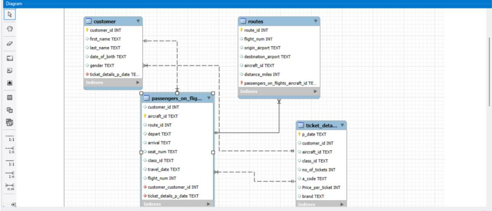

#### Creating and importing Data into Customer, Routes and Ticket Tables

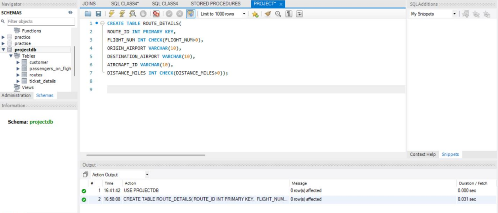

#### Passenger Records for Routes 1 to 25

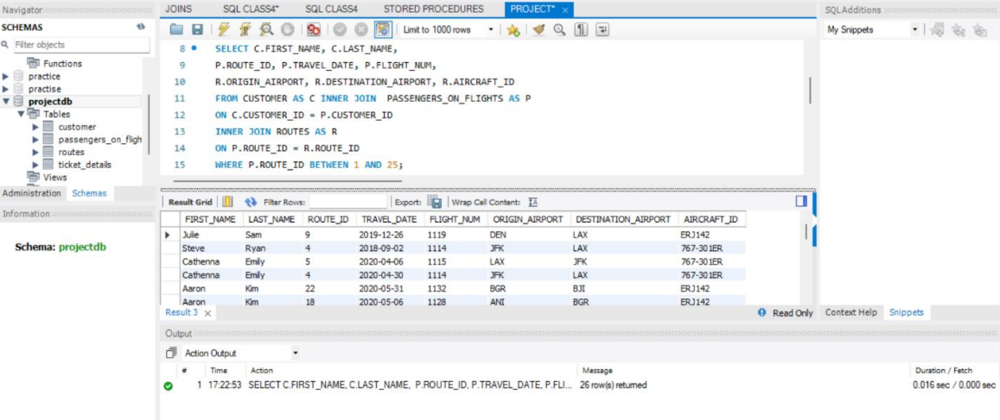

#### Business Class Passenger and Ticket Revenue Analysis

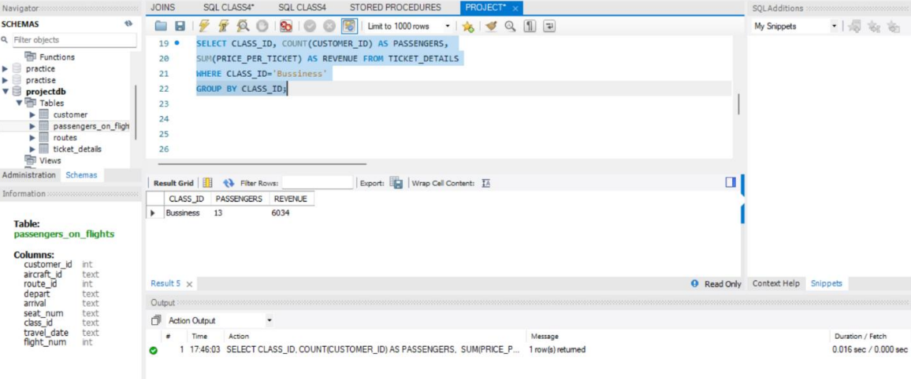

#### Customer Full Name Extraction

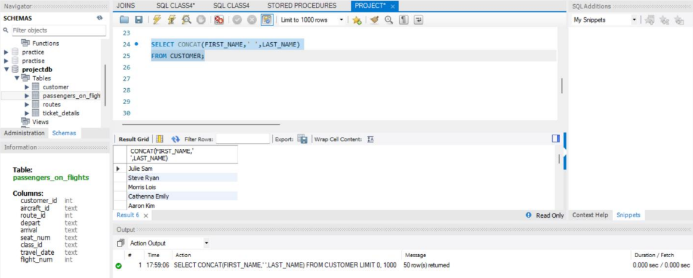

#### Registered Customer Details and Booking Status

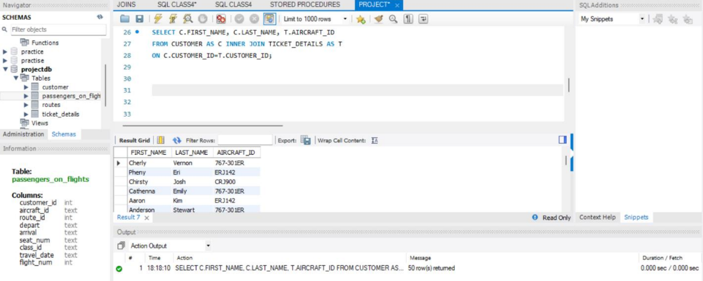

#### Customers who Booked Tickets in 'Emirates' Brand

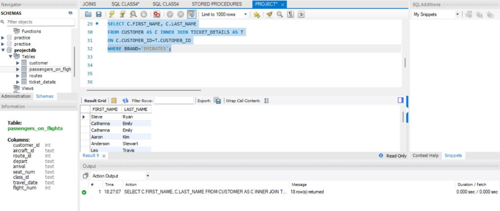

#### Customers who Traveled in Economy Plus Class

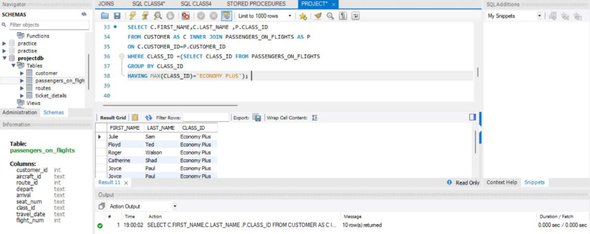

#### Total Revenue Check (Revenue > $10,000)

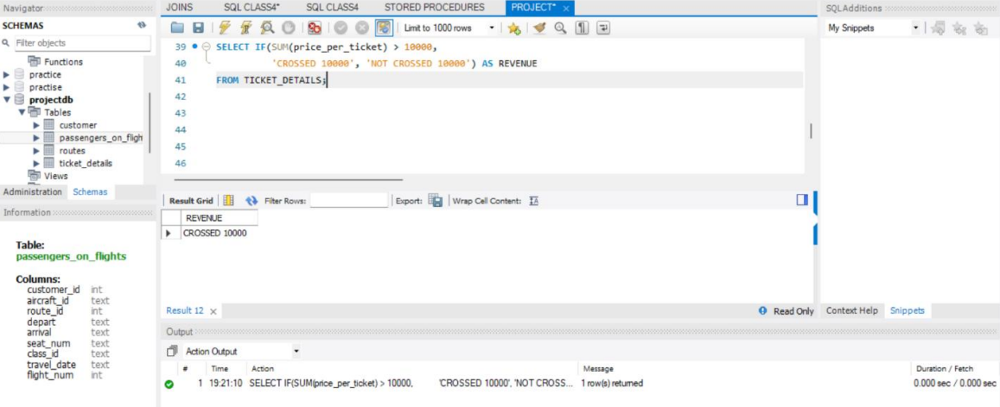

### Phase 2: Intermediate Queries & Views
#### Setting up Permission

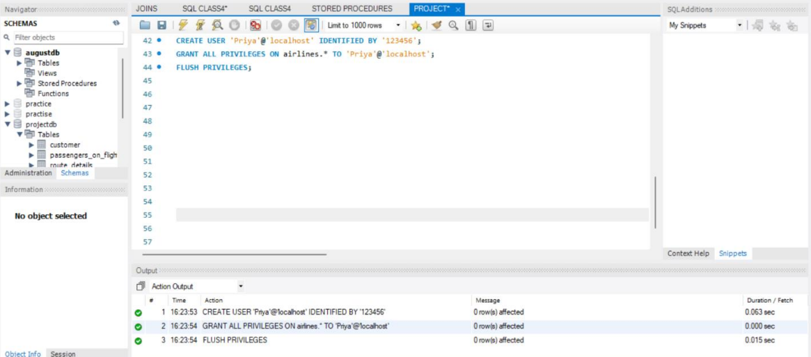

#### Maximum Ticket Price for each Class using Window function

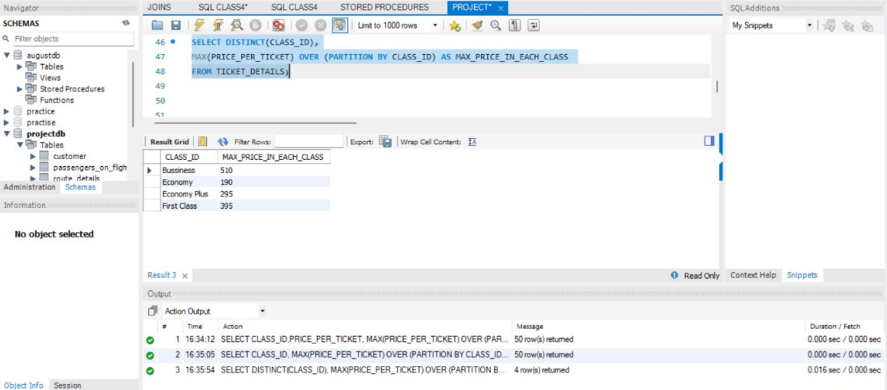

#### Customer Details of Route 4 

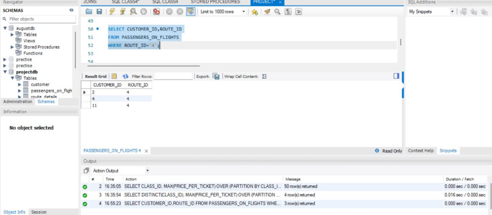

#### Execution plan of Passengers reaching their Destination

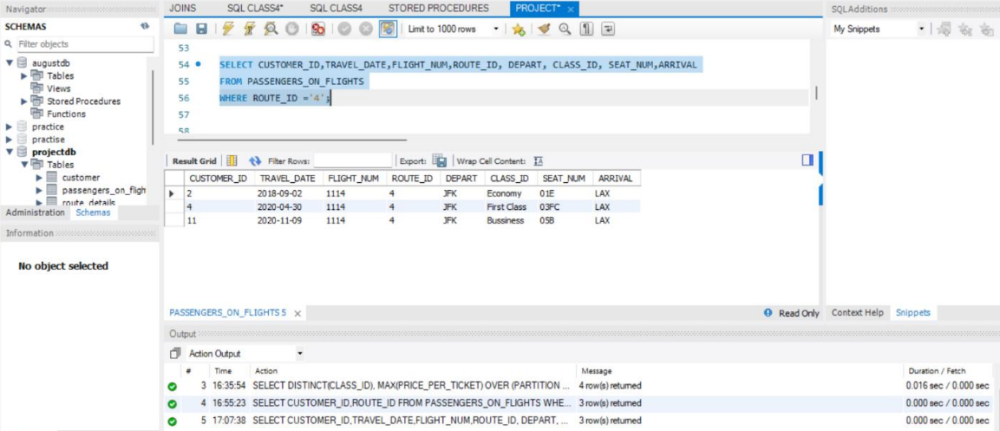

#### Total Revenue Generated per Customer (Rollup)

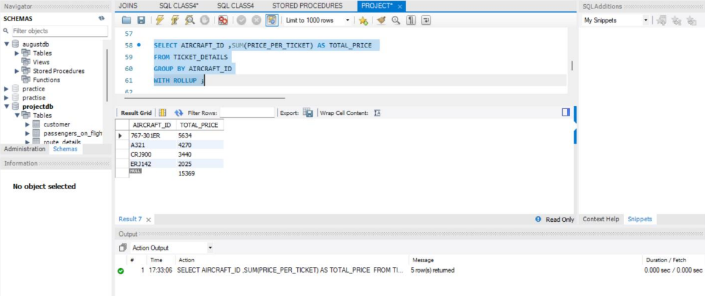

#### View Creation for Business Class Customers

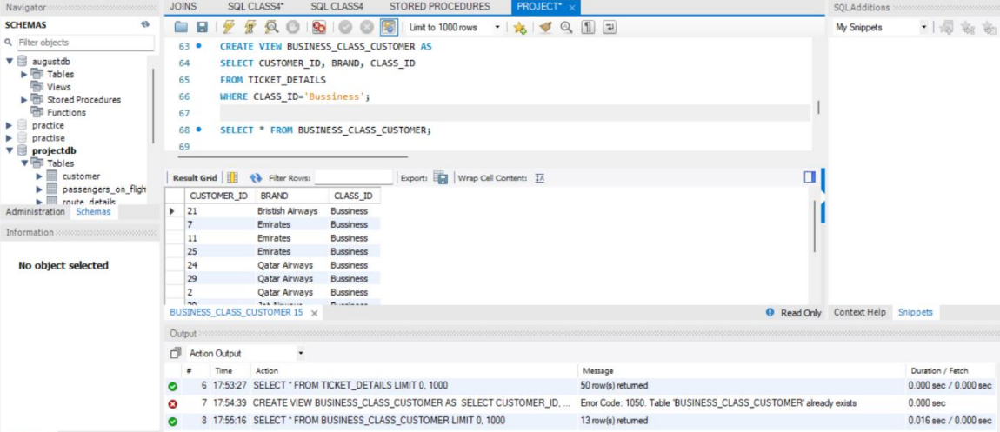

### Phase 3: Advanced SQL (Stored Procedures & Functions)
#### Stored Procedure for Dynamic Route Details

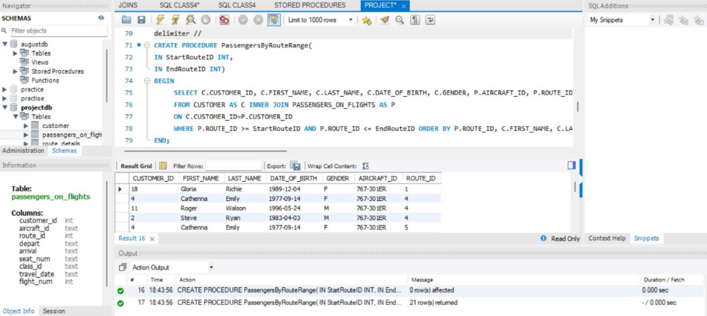

#### Stored Procedure for Routes with Distance > 2000 Miles

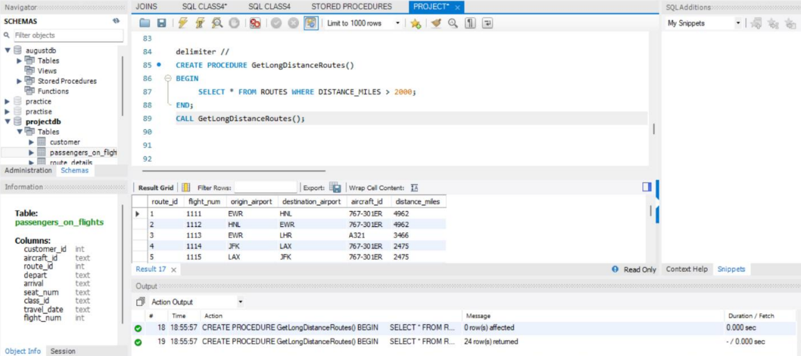

#### Stored Procedure for Distance Categorization

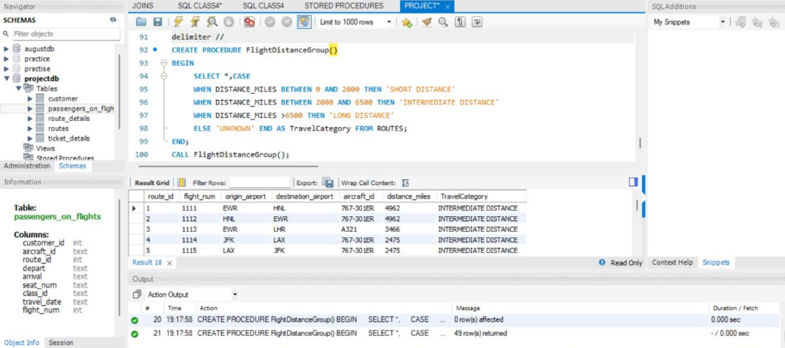

#### Stored Function for Complimentary Service Eligibility

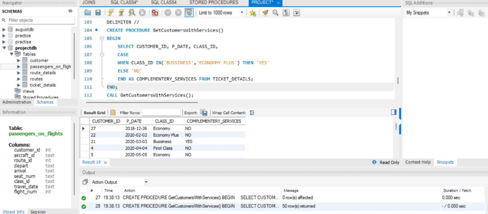

#### Cursor Implementation for Last Name 'Scott'

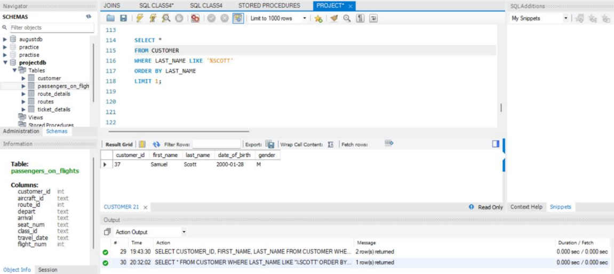

## 📈Final Project Outcomes
#### After completing all 20 tasks, the following key milestones and analytical outcomes were achieved:
### Structural Integrity & Data Design
* #### Database Scheme
* #### Data Validation 
### Customer & Revenue Insights
* #### High-Value Segments
* #### Brand Loyalty
* #### Revenue Benchmarking
### Operational Efficiency
* #### Route Categorization
     * ##### SDT (Short Distance) 0 - 2,000 miles
     * ##### IDT (Intermediate Distance) 2,001 - 6,500 miles
     * ##### LDT (Long Distance) Over 6,500 miles
* #### Search Optimization
### Automation and Advanced Logic
* #### Dynamic Procedures
* #### Service Personalization
* #### Data Security

